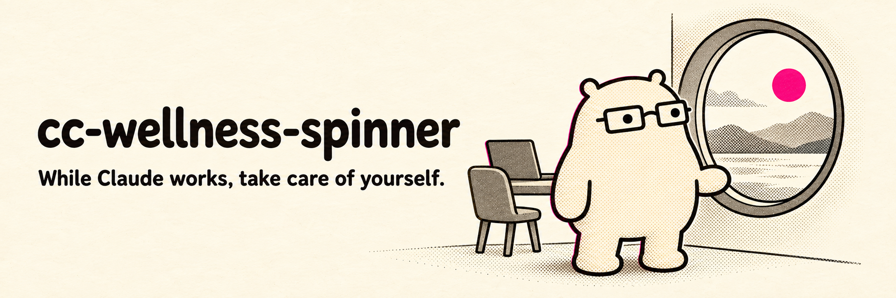

<p align="center">
  
</p>

<h1 align="center">cc-wellness-spinner</h1>
<p align="center"><strong>While Claude works for you, it also looks out for you.</strong></p>

<p align="center">
  <a href="https://github.com/mgiovani/cc-wellness-spinner/actions/workflows/ci.yml"></a>
  <a href="https://github.com/mgiovani/cc-wellness-spinner/blob/main/LICENSE"></a>
  
  <!-- Once published to PyPI, add:
  <a href="https://pypi.org/project/cc-wellness-spinner/"></a>
  -->
</p>

A zero-dependency Python CLI (stdlib only) that swaps Claude Code's spinner
words for one-line wellness nudges: 48 English messages, 47 Portuguese,
append or replace, uninstall anytime. No fork, no patched binary, no
telemetry, just `settings.json`.

## What it looks like

```
✶ Working. Meanwhile, go drink more water and stay hydrated…
✶ Working. Unclench your jaw and drop those shoulders…
✶ Working. Look at something far away for twenty seconds…
✶ Trabalhando. Bebe uma aguinha enquanto isso…
```

## 10-second quick start

```bash
uvx cc-wellness-spinner

# prefer a pinned, reproducible install?
uvx cc-wellness-spinner==0.2.0
```

Pick a language, pick a mode, see a 5-message preview, confirm. Done.

Requires a Claude Code version with the `spinnerVerbs` setting (verified on
v2.1.207). Restart any running session to pick it up.

## Why

A Claude Code session hands you dozens of little `Compacting…` /
`Pondering…` moments a day, pure dead time waiting on tokens.
This tool turns that dead time into something: a
one-line nudge to drink water, unclench your jaw, or look away from the
screen for a few seconds. Same spinner, same speed. Slightly less hunched
by the end of the day.

## Usage

```bash
# Skip every prompt
uvx cc-wellness-spinner --lang pt-BR --mode replace

# Preview a pack without installing anything
uvx cc-wellness-spinner --list

# See the exact settings.json this would write (nothing touched)
uvx cc-wellness-spinner --dry-run

# Remove it; Claude Code falls back to its own defaults
uvx cc-wellness-spinner --uninstall
```

No TTY (CI, scripts, piped stdin)? It defaults to `--lang en --mode replace`
and prompts for nothing.

## Flags

| Flag | Description |
|---|---|
| `--lang <en\|pt-BR>` | Message pack language (case-insensitive) |
| `--mode <append\|replace>` | `append` = defaults + custom, `replace` = custom only |
| `--list` | Print the chosen message pack and exit |
| `--dry-run` | Print the resulting settings.json, write nothing |
| `--uninstall` | Remove the `spinnerVerbs` key from settings.json |
| `--help` | Show this help |
| `--version` | Show the version number |

## How it works

<details>
<summary>The details, for the curious and the careful</summary>

- **No network calls, no telemetry.** The whole CLI is one ~300-line
  stdlib-only file: [read it yourself](src/cc_wellness_spinner/__init__.py).
- **`append`** adds your messages to Claude Code's built-in defaults;
  **`replace`** uses only yours.
- Every write is **read-merge-write**: your existing `settings.json` is
  parsed, every other key is left untouched, and only `spinnerVerbs`
  changes. If it fails to parse, nothing is written, ever.
- Writes are **atomic** (temp file + rename) and **symlink-safe**: if
  `settings.json` is a symlink (stow, chezmoi, any dotfiles manager), the
  symlink's target gets the new content and the symlink itself is left
  alone.
- Install `--dry-run` prints pure, parseable JSON to stdout, so pipe it into
  `jq`, diff it, whatever. (`--uninstall --dry-run` prints a human-readable
  summary instead.)
- Messages never end in punctuation (Claude Code appends the `…` itself)
  and fit a 64-character budget so they don't wrap awkwardly next to the
  spinner.

</details>

Don't want the CLI at all? `spinnerVerbs` is just JSON, so merge it into
`~/.claude/settings.json` (or `$CLAUDE_CONFIG_DIR/settings.json`) by hand:

```json
{
  "spinnerVerbs": {
    "mode": "replace",
    "verbs": ["Working. Meanwhile, go drink more water and stay hydrated"]
  }
}
```

## Add your language

cc-wellness-spinner currently speaks English and Portuguese, 95 messages
between them. It should speak yours too, and it's a genuinely 15-minute PR:

1. Copy `src/cc_wellness_spinner/packs/en.json` to `packs/<code>.json`
   (`es.json`, `fr.json`, `ja.json`, whatever fits).
2. Translate `name` and every entry in `verbs`. Keep a fixed prefix (your
   translated "Working."), stay ≤ 64 characters, skip trailing punctuation,
   emoji, and double spaces. The test suite checks all of it for you.
3. Add `<code>` to `LANGS` in `src/cc_wellness_spinner/__init__.py`.
4. `uv run pytest`. Green means it's ready.
5. Open a PR.

No build step, no style guide to memorize, just JSON and a test suite that
has your back.

## License

MIT. See [LICENSE](LICENSE).
